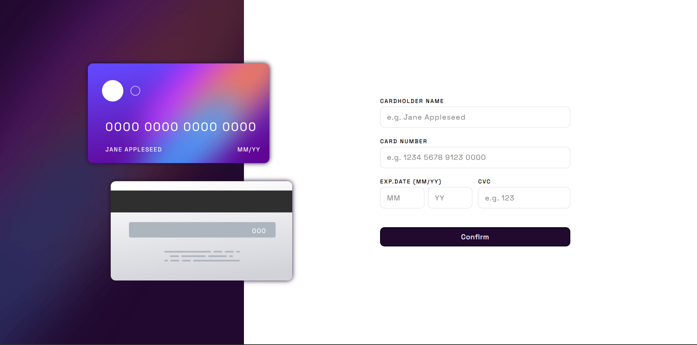

# Frontend Mentor - Interactive card details form solution

This is a solution to the [Interactive card details form challenge on Frontend Mentor](https://www.frontendmentor.io/challenges/interactive-card-details-form-XpS8cKZDWw). Frontend Mentor challenges help you improve your coding skills by building realistic projects. 

## Table of contents

- [The challenge](#the-challenge)
- [Screenshot](#screenshot)
- [Links](#links)
- [Built with](#built-with)
- [Author](#author)

### The challenge

Users should be able to:

- See the size of the elements adjust based on their device's screen size
- Perform mathmatical operations like addition, subtraction, multiplication, and division
- Adjust the color theme based on their preference
- **Bonus**: Have their initial theme preference checked using `prefers-color-scheme` and have any additional changes saved in the browser

### Screenshot

### Links

- [Solution URL](https://github.com/Siluetaz/interactive-card-frontend-mentor)
- [Live site URL](https://siluetaz.github.io/interactive-card-frontend-mentor/)

### Built with

- Semantic HTML5 markup
- CSS custom properties
- Flexbox
- CSS Grid
- SASS
- [Vue](https://vuejs.org/) - JS library

## Author

- GitHub - [Siluetaz](https://github.com/Siluetaz)
- Frontend Mentor - [Siluetaz](https://www.frontendmentor.io/profile/Siluetaz)
